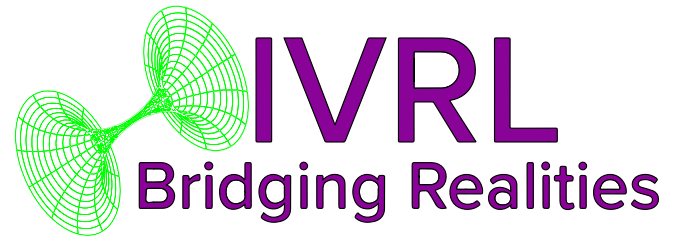

# Noble-Mist
Web3 game downloader/distribution using Valist. Adds game green-lighting (filter on top of Valist), game rating tags (violence, gore, profanity, nudity, etc.), and keywords. Includes game overlay (Windows supported only currently) Page/Community/Release creation (Lens Protocol), Adds an Achievement system for games via ERC-1155. You can estimate your carbon emissions and use Tourcan to offset your gaming earning Noble Mist Achievements / Badges / NFTs. Chat functionality will be supported via WebRTC at a later date. (Windows supported only currently)

# Why not chat via-Discord?
You are free to reach out to the Discord team and ask them to open the API up to alternative clients. However, we can not provide integration as it's a Terms of Service violation.

# Why not X blockchain messenger
None exist. We found two possible messengers. One has not launched, and the other I can't even understand the documentation if it's possible to make your own client.

## Project setup
```
npm install
```

### Compiles and hot-reloads for development
```
npm run serve
```

### Compiles and minifies for production
```
npm run build
```

### Run your end-to-end tests
```
npm run test:e2e
```

### Lints and fixes files
```
npm run lint
```

# Scripts

Run `npm electron:dev` to work with electron in development mode.
```bash
npm electron:dev
```

Run `npm app:build` to build your electron app.
```bash
npm app:build
```

Run `npm dev` to open vite in browser in development mode.
```bash
npm dev
```
Run `npm build` to build files and can be served.
```bash
npm build
```